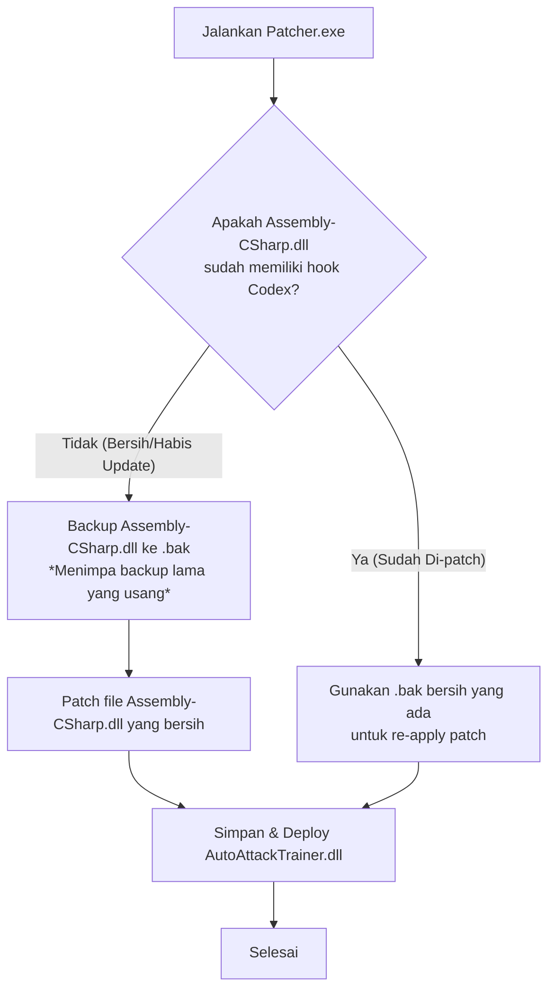

# Panduan Pembaruan Codex Trainer (Patch Guide)

Dokumen ini menjelaskan cara kerja patcher Codex yang baru, langkah-langkah penanganan ketika game mengalami pembaruan (patch) di Steam, serta informasi apa saja yang harus diberikan ke AI jika memerlukan bantuan pembaruan di masa mendatang.

---

## 1. Mekanisme Patcher Baru (Self-Healing Backup)

Patcher Codex v2.0 sekarang menggunakan logika deteksi dinamis untuk menghindari kegagalan kompatibilitas file akibat pembaruan game:



Dengan logika ini:
* **Backup selalu sinkron** dengan versi game terbaru karena backup lama otomatis tertimpa saat game bersih terdeteksi.
* Patcher tidak akan menduplikasi hook jika dijalankan berulang kali pada versi game yang sama.

---

## 2. Prosedur Standar Saat Game Update (Steam Patch)

Jika AdventureQuest Worlds Infinity melakukan update di Steam, ikuti langkah-langkah berikut:

1. **Jalankan Patcher Baru**:
   Cukup buka folder `Publish` dan jalankan kembali **`Patcher.exe`**. Logika baru akan otomatis mengenali file game bersih hasil update, memperbarui file `.bak`, dan memasang Codex kembali.
2. **Uji Coba Game**:
   Buka game dan ketik `/codex` untuk memastikan menu trainer berfungsi.

---

## 3. Apa yang Harus Dilakukan Jika Pembaruan Gagal?

Jika setelah menjalankan Patcher game mengalami crash, tidak bisa dibuka, atau menu `/codex` tidak muncul, kemungkinan besar game developer mengubah struktur kode (API/Method) internal game. 

Jika hal ini terjadi, **laporkan ke AI dengan memberikan informasi berikut**:

### A. Folder `New_Assembly-CSharp`
Kirimkan folder atau file sumber dari dekompilasi `Assembly-CSharp.dll` yang baru. File-file penting yang biasanya rentan terhadap perubahan struktur meliputi:
* `Main.cs` (lokasi inisialisasi / hook utama)
* `UIChatActions.cs` (lokasi intercept chat command `/codex`)
* `Combat.cs` (lokasi bypass range/jarak serang)
* `ResponseResPlayer.cs` (lokasi penanganan respawn cell)

### B. Output Error Kompilasi
Jika modifikasi trainer tidak dapat di-build, jalankan perintah berikut di terminal/Powershell folder project dan berikan output error-nya:
```powershell
dotnet build
```

### C. Log Konsol atau Gejala Masalah
Jelaskan perilaku game saat dicoba:
* Apakah game langsung menutup (crash to desktop)?
* Apakah game terbuka tetapi tombol `/codex` tidak merespon?
* Apakah fitur tertentu seperti *Infinite Range* atau *Auto Attack* tidak berfungsi?

---

*Dokumen ini disimpan di folder utama project sebagai acuan pemeliharaan Codex.*
